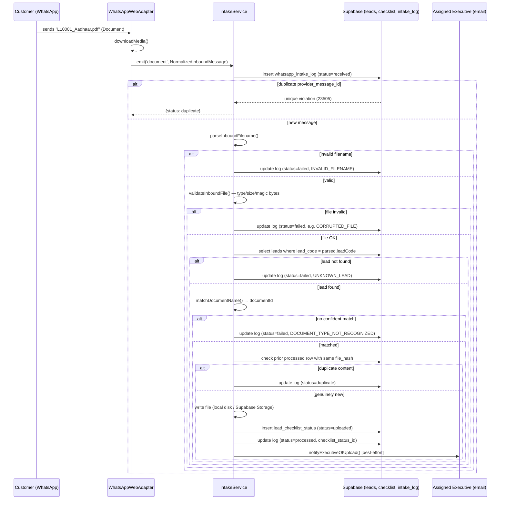

# WhatsApp Document Intake — Architecture & Migration Plan

Automatically pulls customer documents sent over WhatsApp into InstaFin Portal,
linked to the right lead and checklist item, with zero paid services. This
doc covers the design as built in `backend/src/whatsapp-intake/`.

## 1. Why this shape

The brief asked for Spring Boot; the real InstaFin backend is Node/Express +
Supabase (confirmed by reading the repo — no JVM code exists here). Rather
than bolt on a disconnected Java service, this was built as a module inside
the existing backend, reusing its Supabase client, auth middleware, and the
`leads` / `lead_checklist_status` tables the rest of the portal already
writes to. See the chat for the explicit decision.

## 2. Architecture

```
WhatsApp (customer)
      │  sends "L10001_Aadhaar.pdf" as a Document attachment
      ▼
┌─────────────────────────────┐        ┌──────────────────────────────┐
│  WhatsAppWebAdapter          │  ...   │  CloudApiAdapter (future)     │
│  (whatsapp-web.js, free,     │  or    │  (official Meta Cloud API,    │
│   unofficial — default)      │        │   webhook-driven)             │
└──────────────┬────────────────┘        └───────────────┬──────────────┘
               │  both emit the same event:
               │  'document' → NormalizedInboundMessage
               ▼
      ┌──────────────────────────┐
      │  intakeService.js         │   provider-agnostic core logic
      │  processInboundDocument() │   (never imports an adapter)
      └───────────┬───────────────┘
                   │
     ┌─────────────┼──────────────────┬────────────────────┐
     ▼             ▼                  ▼                    ▼
filenameParser  documentCatalog   fileValidation      notifyExecutive
(parse LeadID+  (keyword match →  (type/size/magic-    (email, best-
 doc name)       documentId)       byte corruption      effort)
                                    check)
     │
     ▼
 Supabase: leads, lead_checklist_status, whatsapp_intake_log
 (+ uploads/ local disk in dev, Supabase Storage in production —
  same split the manual upload routes already use)
```

**The one rule that makes migration cheap:** nothing below `intakeService.js`
knows which WhatsApp channel a message arrived on. Both adapters normalize to
the same `NormalizedInboundMessage` shape (`inboundAdapter.js`). Swapping
providers is an adapter swap, not a rewrite — see §7.

## 3. Entity design

### `leads` (existing table, one column added)

| column      | type | notes                                                            |
|-------------|------|-------------------------------------------------------------------|
| `lead_code` | text | **new.** `L10001`, `L10002`, ... Auto-assigned by a DB trigger on insert; backfilled for existing rows. This is the `<LeadID>` customers type into WhatsApp — the real primary key (`id`, a uuid) never appears outside the system. |

### `whatsapp_intake_log` (new table — full audit trail)

| column | type | notes |
|---|---|---|
| `id` | uuid pk | |
| `provider` | text | `whatsapp-web` \| `whatsapp-cloud` |
| `provider_message_id` | text | dedupe key — unique with `provider` |
| `sender_number` | text | |
| `original_filename` | text | exactly as received |
| `mime_type`, `file_size_bytes`, `file_hash` | | `file_hash` (sha256) powers duplicate detection |
| `parsed_lead_code`, `parsed_document_name` | text | result of filename parsing, kept even on failure |
| `matched_lead_id` | uuid fk → leads | null if the lead wasn't found |
| `matched_document_id` | text | the resolved checklist document type, e.g. `kyc_aadhaar` |
| `checklist_status_id` | uuid fk → lead_checklist_status | the row this upload created |
| `status` | text | `received` → `processed` \| `duplicate` \| `failed` |
| `failure_code`, `failure_reason` | text | machine + human reason, see §5 |
| `notified_executive` | boolean | |
| `received_at`, `processed_at` | timestamptz | |

Every inbound message gets a row the instant it arrives (`status = received`),
*before* any validation — so a crash mid-processing still leaves a trace
instead of silently losing the message. See `migrations/025_whatsapp_intake.sql`.

`lead_checklist_status` (existing table) is reused as-is: a successful
WhatsApp upload inserts a row exactly like the manual "Checklists" page does,
with `document_name` carrying a description noting it arrived via WhatsApp
(`"Received via WhatsApp from 9199..."`) and the original filename preserved.

## 4. REST API (admin/monitoring — the intake itself has no public HTTP surface in the default whatsapp-web mode)

| Method & path | Role | Purpose |
|---|---|---|
| `GET /api/whatsapp-intake/status` | admin, operations_head | Connection state: `connecting` \| `ready` \| `disconnected`, last error, whether a QR is waiting |
| `GET /api/whatsapp-intake/qr` | admin, operations_head | Current QR code (data URL) to link the WhatsApp device |
| `GET /api/whatsapp-intake/logs?status=&leadId=&limit=` | admin, operations_head, executive | Recent inbound messages and their outcome |
| `GET /api/whatsapp-intake/logs/lead/:leadId/summary` | any portal role | Per-lead counts (processed/failed/duplicate) for a checklist badge |
| `GET/POST /api/whatsapp-intake/webhook` | *(none — Meta calls this)* | Only live once `WHATSAPP_INTAKE_PROVIDER=whatsapp-cloud`; verifies `X-Hub-Signature-256` inside `CloudApiAdapter` |

All routes above except the webhook go through the existing `authenticate` +
`authorize` middleware, same as every other route in the app.

## 5. Failure handling

Every failure path writes a row to `whatsapp_intake_log` with a specific
`failure_code` — nothing is a silent 500:

| `failure_code` | Cause |
|---|---|
| `INVALID_FILENAME` | Doesn't match `<LeadID>_<DocumentName>.<ext>` |
| `INVALID_LEAD_CODE` | Lead ID isn't `L` + digits |
| `UNKNOWN_LEAD` | No lead with that code exists |
| `UNSUPPORTED_FILE_TYPE` | Extension not in the allow-list (pdf, jpg/jpeg, png, doc, docx, xls, xlsx) |
| `FILE_TOO_LARGE` | Over 10MB (same limit the manual upload enforces) |
| `CORRUPTED_FILE` | Empty, or content's magic bytes don't match the claimed extension |
| `DOCUMENT_TYPE_NOT_RECOGNIZED` | Document name doesn't match the keyword catalog |
| `LEAD_LOOKUP_FAILED` / `STORAGE_WRITE_FAILED` / `CHECKLIST_WRITE_FAILED` / `LOG_WRITE_FAILED` | Network/DB failures — logged with the raw error message |

Duplicates are a separate `status = 'duplicate'`, not a failure — two cases:
1. The provider redelivers the same message (same `provider_message_id`) — a
   unique constraint on `(provider, provider_message_id)` makes the second
   insert fail with Postgres code `23505`, treated as a no-op.
2. The exact same file content is sent again under a *new* message (e.g. the
   customer forwards it twice) — detected by `file_hash` matching a prior
   `processed` row for the same lead + document type.

## 6. Known scoping limits (read before treating this as done)

- **Checklist requirement matching is catalog-wide, not lead-specific.** The
  frontend narrows which documents are required for one lead via a
  client-side decision tree (loan type × status × income source × resident
  type) plus optional per-browser `localStorage` keyword overrides
  (`src/utils/resolver.ts`, `src/utils/bulkDocMatcher.ts`). Neither is
  available server-side today. Intake therefore validates "is this a real,
  known document type" against the full keyword catalog
  (`documentCatalog.js`, kept in sync with `bulkDocMatcher.ts`), not "is this
  specifically required for lead X". The executive still sees the true
  per-lead checklist in the portal UI. Closing this gap means porting the
  decision tree server-side (or exposing it via a small internal API) — a
  good Phase 2 item, not attempted here to keep the POC's surface honest.
- **Photos vs. Documents.** WhatsApp only preserves the original filename for
  attachments sent via the paperclip's "Document" picker. Anything sent as a
  "Photo" gets recompressed and renamed by WhatsApp client-side, so the
  `<LeadID>_<DocName>` convention is lost before it reaches this service.
  Customers must be told (in the WhatsApp welcome/checklist message) to send
  documents as Documents, not Photos.
- **whatsapp-web.js is unofficial.** It automates a real WhatsApp Web
  session; Meta could break or block it without notice. It's the correct
  choice for a *free* POC, not for the long-term production channel — that's
  the entire reason §7 exists.
- **Memory: this is the real cost of "free."** `whatsapp-web.js` runs a
  genuine headless Chromium session via Puppeteer. On Render's free tier
  (512MB RAM total, shared with the Node process itself), a default launch
  was enough to OOM-kill the whole service (observed 2026-09-04). The
  adapter now launches Chromium with a reduced-footprint flag set
  (`--single-process`, `--no-zygote`, `--disable-dev-shm-usage`, disabled
  background features — see `adapters/whatsappWebAdapter.js`), which helps
  but is not guaranteed to fit: a real WhatsApp Web session commonly needs
  300-500MB on its own. If it still OOMs after that change, the real options
  are, in order of effort:
  1. **Upgrade the Render plan for this service** to at least 1GB RAM. Costs
     money, but nothing else in this design does — it's paying for compute,
     not for a WhatsApp API.
  2. **Run the WhatsApp-web adapter somewhere with more free RAM** than
     Render's free tier gives — a spare machine works fine (**this is what
     `npm run whatsapp:local` does, see §9b**), talking to the same Supabase
     database directly. The `InboundAdapter` boundary (§2) is exactly what
     makes this possible without touching `intakeService.js`.
  3. **Skip ahead to the Cloud API (§10).** It has no Chromium to run at
     all — the tradeoff is trading free-but-heavy for cheap-but-official.

## 7. Folder structure

```
backend/
├── migrations/
│   └── 025_whatsapp_intake.sql
├── scripts/
│   └── run-whatsapp-intake-local.js  # runs the session on a spare machine instead of the host — §9b
├── src/
│   ├── whatsapp-intake/
│   │   ├── inboundAdapter.js        # provider-agnostic contract + NormalizedInboundMessage
│   │   ├── adapters/
│   │   │   ├── whatsappWebAdapter.js   # free, unofficial — default
│   │   │   └── cloudApiAdapter.js      # official Cloud API — migration target
│   │   ├── filenameParser.js
│   │   ├── documentCatalog.js
│   │   ├── fileValidation.js
│   │   ├── notifyExecutive.js
│   │   ├── intakeService.js         # processInboundDocument() — the core, provider-agnostic
│   │   └── index.js                 # bootstrap: picks an adapter, wires events, exposes status
│   ├── routes/
│   │   └── whatsappIntake.js        # admin monitoring API + Cloud API webhook route
│   └── services/
│       └── email.service.js         # + sendEmail() generic helper (added)
└── test/
    ├── helpers/fakeSupabase.js
    └── whatsapp-intake/
        ├── filenameParser.test.js
        ├── documentCatalog.test.js
        ├── fileValidation.test.js
        └── intakeService.test.js    # integration test, fake Supabase, real business logic
```

## 8. Sequence diagram



## 9. Setup

Two ways to run the `whatsapp-web` provider, depending on where it's hosted.

### 9a. Hosted alongside the API (needs real RAM)

```bash
cd backend
npm install                       # pulls whatsapp-web.js + puppeteer (bundled Chromium) — free, no API keys
SUPABASE_SERVICE_ROLE_KEY=... node scripts/apply-migration.js 25
WHATSAPP_INTAKE_ENABLED=true npm run dev    # or however the host starts the server
```

On boot, the server logs a prompt to fetch `GET /api/whatsapp-intake/qr`
(as an admin, via the portal's WhatsApp Intake page) and scan it with the
business's WhatsApp phone (**Linked Devices → Link a Device**). The session
persists to `backend/.wwebjs_auth/` (gitignored, alongside `uploads/`), so
this is a one-time step.

**Only viable with enough RAM.** A real WhatsApp Web session under Puppeteer
commonly needs 300-500MB on its own. Confirmed OOM-killing Render's free
512MB tier twice (2026-09-04, 2026-09-05) even after trimming Chromium's
flags — see §6. If your host can't spare that, use 9b instead.

| Var | Default | Purpose |
|---|---|---|
| `WHATSAPP_INTAKE_ENABLED` | `false` | Master on/off switch |
| `WHATSAPP_INTAKE_PROVIDER` | `whatsapp-web` | `whatsapp-web` \| `whatsapp-cloud` |

### 9b. Run the WhatsApp session locally instead (free, works on any host tier)

Keeps the portal (frontend + API) deployed as normal; only the WhatsApp
session itself runs on a spare machine with real RAM, talking to the same
Supabase database — an upload processed locally shows up in the live portal
immediately, same as any other upload.

```bash
cd backend
npm install
npm run whatsapp:local   # node --env-file-if-exists=.env scripts/run-whatsapp-intake-local.js
```

Renders the QR as ASCII directly in the terminal — scan it the same way.
Works with zero setup (falls back to the anon key baked into
`lib/supabase.js`); optionally create a `backend/.env` with
`SUPABASE_SERVICE_ROLE_KEY` and `SMTP_*` vars for full permissions and
executive-notification emails. Leave it running (PM2 or similar, same
pattern as this project's other always-on local bots) whenever WhatsApp
intake should be live. **Set `WHATSAPP_INTAKE_ENABLED=false` (or leave it
unset) on the hosted backend when using this path** — only one process
should hold the WhatsApp session at a time.

## 10. Migration plan: whatsapp-web.js → WhatsApp Business Cloud API

When the client is ready to pay for a verified Meta Business number:

1. **Register the number + get credentials** — WhatsApp Business Account,
   phone number ID, a permanent access token, and an app secret (all in Meta
   Business Manager). This is the only genuinely new setup work; the code
   below already exists.
2. **Set env vars and flip the flag** — no code changes required for a basic
   cutover:
   ```
   WHATSAPP_INTAKE_PROVIDER=whatsapp-cloud
   WHATSAPP_ACCESS_TOKEN=...
   WHATSAPP_APP_SECRET=...
   WHATSAPP_VERIFY_TOKEN=<a string you choose, used in step 3>
   ```
   `index.js`'s `createAdapter()` picks `CloudApiAdapter` instead of
   `WhatsAppWebAdapter` — `intakeService.js`, the DB schema, the admin API,
   and every test are untouched, because both adapters emit the identical
   `NormalizedInboundMessage` shape.
3. **Point Meta's webhook at this server** — in the Meta app dashboard,
   subscribe to the `messages` field and set the callback URL to
   `https://<your-domain>/api/whatsapp-intake/webhook`, verify token matching
   `WHATSAPP_VERIFY_TOKEN`. `CloudApiAdapter.handleVerificationRequest` /
   `handleWebhookRequest` (already implemented, including HMAC-SHA256
   signature verification) handle the rest.
4. **Retire whatsapp-web.js** — stop running the Puppeteer session
   (`WHATSAPP_INTAKE_PROVIDER` no longer resolves to it); `.wwebjs_auth/` can
   be deleted.
5. **Reuse the same outbound channel for notifications, optionally** — the
   existing `services/whatsapp.service.js` already speaks the Cloud API for
   outbound messages; once the Cloud API is live, `notifyExecutive.js` could
   send a WhatsApp message instead of (or in addition to) email with a small,
   additive change.
6. **Everything downstream is unaffected**: `whatsapp_intake_log.provider`
   simply starts recording `whatsapp-cloud` for new rows, side-by-side with
   historical `whatsapp-web` ones — no backfill, no migration script needed.

No other file in the codebase needs to change for this cutover — that
separation is the point of the adapter boundary in §2.
